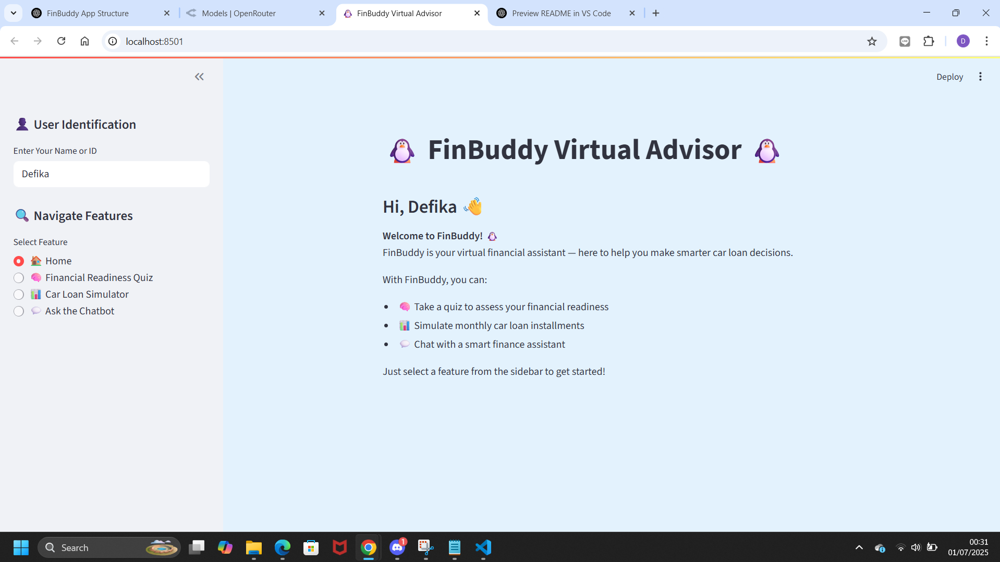
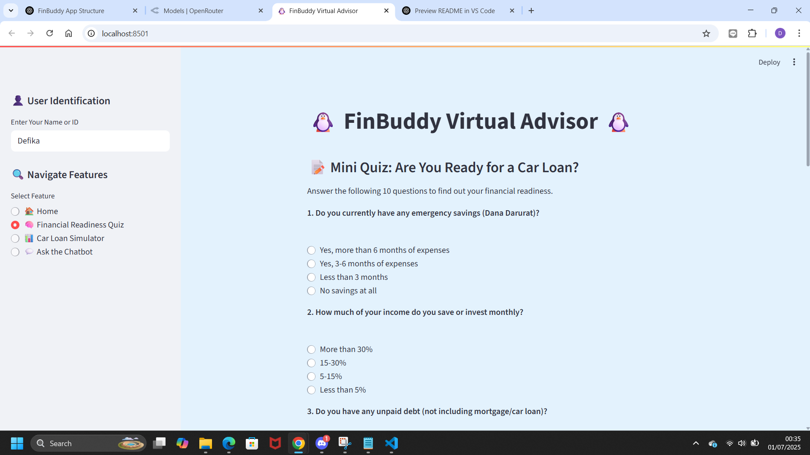

# 🐧 FinBuddy – Virtual Car Loan Advisor

## 🚗 Project Overview

**FinBuddy** is a smart, user-friendly web application designed to help users in Indonesia make better-informed decisions when applying for car loans.

It was created in response to the increasing number of people taking out auto loans without proper financial planning or understanding of the loan structure. FinBuddy combines simulation tools, interactive assessments, and an AI chatbot to guide users toward more responsible credit decisions.

---

## 🌟 Key Features

1. **📊 Car Loan Simulator**  
   Estimate your monthly installment based on car price, down payment, effective interest rate, and loan term.  
   Visualize a monthly breakdown of principal vs. interest paid.

2. **🧠 Financial Readiness Quiz**  
   A quick quiz to assess whether you’re financially ready to take out a car loan.  
   Get personalized insights and suggestions based on your score.

3. **💬 FinBuddy Chatbot**  
   An AI-powered chatbot that provides simple and practical financial advice.  
   Ask anything from budgeting tips to loan explanations — FinBuddy is here to help!

---

## 🖥️ How to Run Locally

1. **Clone the repository**
    ```bash
    git clone https://github.com/your-username/finbuddy.git
    cd finbuddy
    ```
2. **Create virtual environment & install dependencies**
    ```bash
    python -m venv venv
    source venv/bin/activate        # On Windows: venv\\Scripts\\activate
    pip install -r requirements.txt
    ```
3. **(Optional) Create a .env file with your API key**
    ```ini
    OPENROUTER_API_KEY=your_api_key_here
    ```
4. **Run the app**
    ```bash
    streamlit run app.py
    ```
---
## 🖼️ App Preview
| Feature                  | Preview                                |
| ------------------------ | -------------------------------------- |
| Home Screen              |            |
| Financial Readiness Quiz |            |
| Car Loan Simulator       |  |
| Chatbot Interaction      |      |

---
## 🚀 Live App
Try it here:

## 👩‍💻 Developed by
Defika Alviani – with love, finance, streamlit and Python 🐍